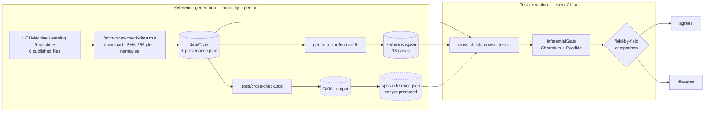
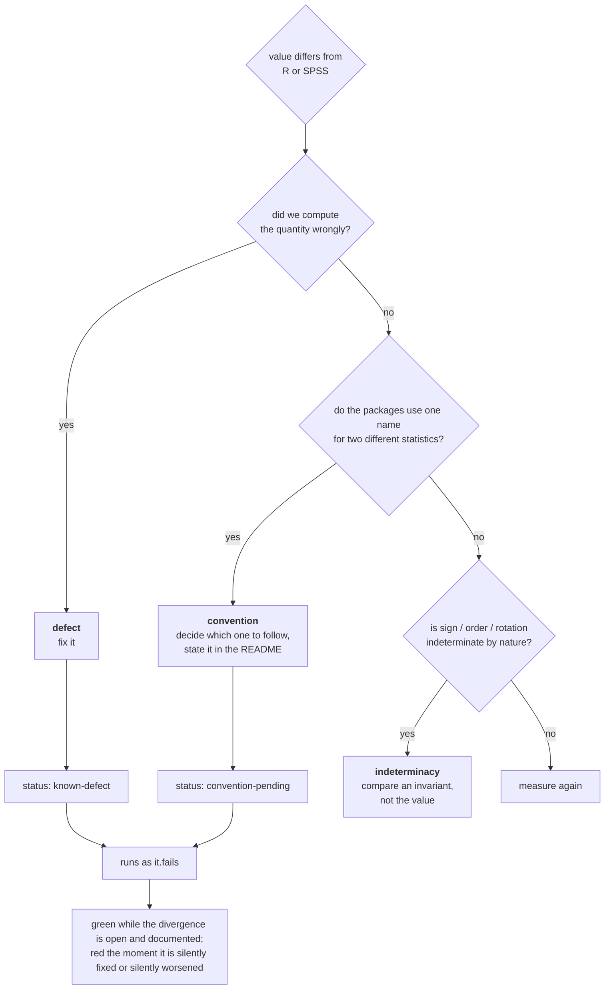
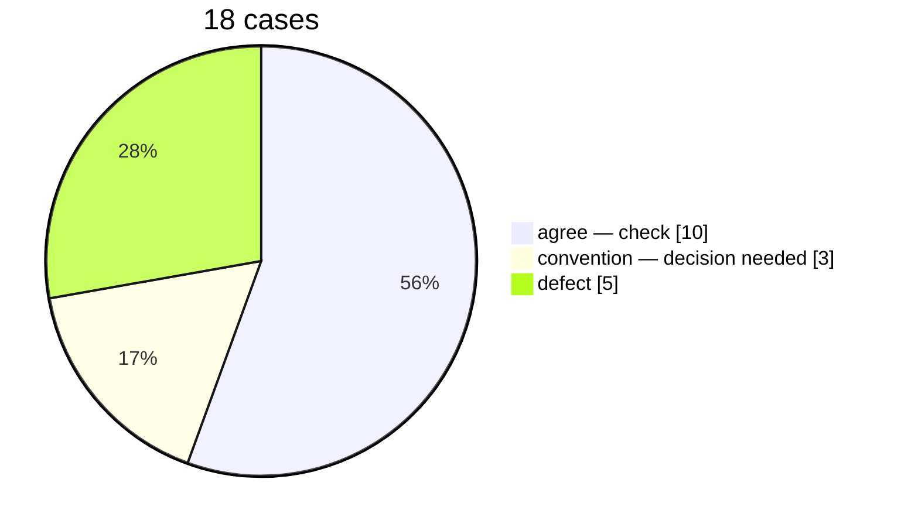
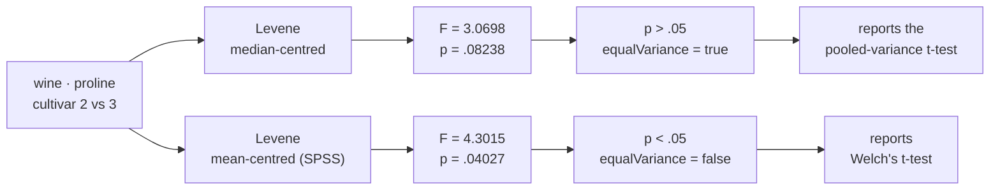

# First R cross-check run

2026-10-06 · `@winm2m/inferential-stats-js` v1.9.0 · reference R 4.2.2 Patched
branch `test/cross-check-r-spss`

This is the record of what was run and what it found. The design and the plan
are in [`cross-check-r-spss.md`](./cross-check-r-spss.md); the SPSS procedure is
in [`spss-manual-run.md`](./spss-manual-run.md).

> **Status note.** This report is a dated snapshot of the first run and is left
> as measured. The three defects it reports in §6.2 were filed as #18, #19 and
> #20 and fixed later the same day; `cross-check-r-spss.md` carries the current
> state. The one residual is that `posthocTukey`'s tail p-values agree with R to
> 1.9e-14 absolute rather than to 1e-9 relative, because statsmodels' `psturng`
> and R's `ptukey` are different implementations of the studentized range
> distribution — see §6.2(a).

---

## 1. Why

This library runs scipy, statsmodels and scikit-learn inside Pyodide, in a
browser worker. Validation before this work had two layers:

| Layer | What it asserts | Coverage |
| :--- | :--- | :--- |
| 98 unit + 2 browser e2e tests | that an analysis **runs** and its result has the right shape | all 16 analysis methods |
| 4 NIST StRD cases | that the result is **right** | `linearRegression`, `anovaOneway` |

NIST certifies four dataset families. Fourteen of the sixteen analysis methods
were therefore guaranteed only to return numbers without raising — and a wrong
number has the right shape.

The packages researchers actually reconcile their output against are R and SPSS.
Running the same data through them is what this work does.

---

## 2. Shape of the thing



Two properties matter.

**All three consumers read the same bytes.** The data is downloaded once,
normalised to CSV, committed, and then read from those files by this SDK, by R
and by SPSS. Nobody reads their own package's copy of the data — see §3 for the
concrete reason that is not pedantry.

**The reference values are committed.** Running the suite needs neither R nor
SPSS nor a network connection, which is the arrangement `nist-strd.json` already
uses. R is needed only to regenerate a fixture.

---

## 3. Data

Three requirements: retrievable from the archive that publishes it, identical for
all three packages, and small enough to read in a diff.

The first rules out a statistics package's bundled copy, and the reason is
concrete rather than theoretical. UCI's `iris.data` carries two transcription
errors against Fisher's 1936 table. UCI's own `iris.names` documents them:

```
The 35th sample should be: 4.9,3.1,1.5,0.2,"Iris-setosa"
where the error is in the fourth feature.
The 38th sample: 4.9,3.6,1.4,0.1,"Iris-setosa"
where the errors are in the second and third features.
```

R's built-in `iris` follows the paper. Neither copy is corrupt — they are
different tables. A reference generated from `datasets::iris` and compared
against a downloaded `iris.data` would be comparing two datasets and reporting
the difference as a numerical error. **The file is used exactly as published,
errors included, because the reference values are computed from that same file.**

`scripts/fetch-cross-check-data.mjs` downloads each dataset, verifies it against
a pinned SHA-256, normalises it to a CSV with a header row, and writes
`provenance.json` recording the URL, digest, retrieval date and citation.

| Dataset | Source | Shape | Carried for |
| :--- | :--- | :--- | :--- |
| Iris | [UCI 53](https://archive.ics.uci.edu/dataset/53/iris) — Fisher (1936) | 150 × 5 | three balanced groups: ANOVA, Tukey, descriptives |
| Auto MPG | [UCI 9](https://archive.ics.uci.edu/dataset/9/auto+mpg) — Quinlan (1993), StatLib/CMU | 398 × 9 | multiple regression; **6 missing values**; two discrete attributes for a 3 × 5 table |
| Wine | [UCI 109](https://archive.ics.uci.edu/dataset/109/wine) — Aeberhard et al. (1992) | 178 × 14 | the **only** dataset here where the two Levene conventions straddle .05 |
| Haberman's Survival | [UCI 43](https://archive.ics.uci.edu/dataset/43/haberman+s+survival) — Haberman (1976) | 306 × 4 | an outcome coded **1/2**, as registry and survey data arrive |
| Breast Cancer Wisconsin (Original) | [UCI 15](https://archive.ics.uci.edu/dataset/15/breast+cancer+wisconsin+original) — Wolberg & Mangasarian (1990) | 699 × 11 | nine attributes graded 1–10 on one scale: a commensurable item set; 16 missing |
| SPECT Heart (training split) | [UCI 95](https://archive.ics.uci.edu/dataset/95/spect+heart) — Kurgan et al. (2001) | 80 × 23 | **all 23 attributes binary**: a native 2 × 2 table with nothing binned or filtered |

Total 63 KB. Each is carried for a property no substitute had:

- **Auto MPG**'s 6 missing `horsepower` values are kept as empty CSV fields, so
  listwise deletion is compared rather than hidden — `lm`, SPSS
  `/MISSING=LISTWISE` and the Python layer must all reach n = 392.
- **Wine** supplies the one place in these six datasets where mean-centred and
  median-centred Levene fall on opposite sides of .05, which is what makes that
  convention observable in a reported result rather than only in an auxiliary
  number (§6.4).
- **SPECT Heart** is used as its published training split rather than recombined
  with the test split, because a recombined file would be a dataset nobody
  publishes.

SPSS's own sample files (`Employee data.sav` and the rest) are deliberately not
used: they are licensed to SPSS installations and cannot be committed here.

---

## 4. How a difference is classified

This is the core of the design. "The number differs from SPSS" is not actionable
on its own.



`it.fails` is the device `nist-strd.browser.test.ts` already uses for Longley.
A tolerance is never loosened to absorb a difference — **the difference is kept as
executable evidence.** When a defect is fixed, its test turns red, and changing
the status is part of the fix.

### One case per claim

`crosstabs` computes the chi-square correctly and labels its categories
incorrectly. Folding both into one case would put a single `it.fails` over them,
and a chi-square that later drifted would be reported as "still failing" rather
than as a new failure. The statistics and the labels are therefore separate
cases.

---

## 5. What was run where

**18 cases** (plus one fixture self-check, so 19 tests).

| # | Case | Data | SDK method | R reference | Compared | Status |
| :-- | :--- | :--- | :--- | :--- | --: | :--- |
| 1 | descriptives, g1/g2 | iris | `descriptives` | `e1071::skewness(type=1)`, `quantile(type=7)`, `sd` | 40 | check |
| 2 | descriptives, G1/G2 | iris | `descriptives` | `e1071::skewness(type=2)` | 40 | **convention** |
| 3 | crosstabs 3 × 5 | auto-mpg | `crosstabs` | `chisq.test(correct=FALSE)` | 4 | check |
| 4 | crosstabs 2 × 2, Pearson | spect | `crosstabs` | `chisq.test(correct=FALSE)` | 4 | **convention** |
| 5 | crosstabs 2 × 2, Yates | spect | `crosstabs` | `chisq.test(correct=TRUE)` | 4 | check |
| 6 | category labels | auto-mpg | `crosstabs` | `rownames/colnames(table())` | 8 labels | **defect** |
| 7 | category labels | spect | `crosstabs` | same | 4 labels | **defect** |
| 8 | independent t + Levene | haberman | `ttestIndependent` | `t.test`, `car::leveneTest(center=median)` | 26 | check |
| 9 | independent t + Levene | wine | `ttestIndependent` | same | 26 | check |
| 10 | Levene, mean-centred | wine | `ttestIndependent` | `car::leveneTest(center=mean)` | 2 + 1 flag | **convention** |
| 11 | paired t | bcw | `ttestPaired` | `t.test(paired=TRUE)` | 10 | check |
| 12 | one-way ANOVA | iris | `anovaOneway` | `aov` + `summary` | 18 | check |
| 13 | Tukey HSD | iris | `posthocTukey` | `TukeyHSD` | 12 | **defect** |
| 14 | regression, `method:'enter'` | auto-mpg | `linearRegression` | `lm`, `confint`, `car::durbinWatsonTest` | 32 | check |
| 15 | regression, default method | auto-mpg | `linearRegression` | same | 6 + 3 absent | **defect #13** |
| 16 | binary logistic, 0/1 outcome | spect | `logisticBinary` | `glm(binomial)`, `confint.default` | 27 | check |
| 17 | binary logistic, 1/2 outcome | haberman | `logisticBinary` | `glm(factor(y) ~ .)` | call fails | **defect** |
| 18 | Cronbach's alpha | bcw | `cronbachAlpha` | formula + `cor` | 67 | check |

"Compared" counts **leaf values**. Case 14, for instance, matches 4 coefficients
× (estimate, standard error, t, p, lower bound, upper bound) plus 8 model-summary
fields = 32 numbers individually. In total **318 numeric quantities and 16
category labels** were matched.

### Matching by identity, not by position

R names a Tukey contrast `Iris-versicolor-Iris-setosa` and statsmodels orders the
pair its own way. Both are correct. Arrays are therefore matched on an identity
key (`group1`+`group2`, `variable`, `item`, `group`) rather than by index; things
whose order is meaningful, like a confidence interval, are matched positionally.

### Tolerances

| Applies to | Tolerance | Why |
| :--- | :--- | :--- |
| Closed-form procedures (t, ANOVA, OLS, χ², α) | **1e-9** relative | R and this SDK evaluate the same estimator on the same bytes, so the only gap is floating-point association order. The NIST work established that this codebase holds nine digits on well-conditioned problems. |
| Iteratively fitted models (logistic) | **1e-5** relative **or** 1e-5 absolute | R's `glm` iterates by IRLS until the relative deviance change is below `1e-8`; statsmodels maximises by Newton–Raphson against its own tolerance. Neither stops at the exact maximum, so the distance between them is set by convergence criteria, not by rounding. The absolute leg carries quantities that straddle zero, where a relative error is inflated by a small denominator rather than by the fit. |
| SPSS | not yet set | OXML carries the unrounded value per cell, so the bound can be tight. If a quantity turns out to be available only as formatted text, a pivot table's three decimals cap it at 5e-4 absolute / 1e-3 relative. |

---

## 6. Results



The five defect cases are **four distinct defects**: the category-label problem
appears on two datasets.

### 6.1 Agreement — 10 cases, 254 numeric quantities

| Case | Compared | Worst relative error | At |
| :--- | --: | --: | :--- |
| descriptives, g1/g2 | 40 | `1.07e-14` | `sepal_width.kurtosis` |
| crosstabs 3 × 5 | 4 | `2.09e-14` | `pValue` |
| crosstabs 2 × 2, Yates | 4 | `2.79e-14` | `pValue` |
| independent t — haberman | 26 | `1.22e-11` | `unequalVariance.confidenceInterval[1]` |
| independent t — wine | 26 | `1.54e-11` | `equalVariance.confidenceInterval[1]` |
| paired t | 10 | `3.69e-14` | `pValue` |
| one-way ANOVA | 18 | `1.05e-14` | `pValue` |
| regression, `method:'enter'` | 32 | `4.55e-13` | `coefficients[const].pValue` |
| binary logistic (0/1) | 27 | `5.59e-06` | `coefficients[f2].confidenceInterval[0]` |
| Cronbach's alpha | 67 | `1.01e-14` | `itemAnalysis[mitoses].correctedItemTotalCorrelation` |

Of the 254 quantities, **239 are within 1e-9**, and all 15 that are not belong to
the logistic case. The **nine closed-form cases do not have a single quantity
outside 1e-9** — their worst is `1.54e-11`, on a t-test confidence bound, which
is a subtraction that spends significant digits and is expected to sit there.

Two of those cases are load-bearing beyond their numbers:

- **Regression on auto-mpg** agrees to 4.6e-13 across coefficients, standard
  errors, t, p, confidence intervals, the ANOVA table and Durbin–Watson — *and*
  reports `observations: 392`. All three packages dropped the same 6 rows with a
  missing `horsepower`.
- **Cronbach's alpha** agrees across all 67 quantities including every
  item-total column, and `caseProcessing` reports 683 valid of 699 — the same
  listwise split R computes from the 16 missing `bare_nuclei` values.

The logistic case is the one with a different order of magnitude, and the
distribution across its 27 quantities shows why:

| Quantity | Relative error |
| :--- | --: |
| standard errors, z | `3.5e-07` – `6.9e-08` |
| p-values | `9.0e-08` – `1.4e-06` |
| confidence bounds | `1.2e-07` – `5.6e-06` |

Confidence bounds are worst because a bound is `coefficient ± 1.96 × se` and so
carries both errors; the worst of them, `-0.0870`, is also near zero, which
inflates the relative error without the fit being any further off — the absolute
difference is 4.9e-7. This is not a defect. It is the distance two different
optimisers stop at, which is why this case carries an explicit tolerance and the
generator records the measurement behind it.

### 6.2 New defects

#### (a) `posthocTukey` truncates every value to four decimals, and p-values to zero

`compare-means.ts:199-206` reads `pairwise_tukeyhsd(...).summary().data` — that is
statsmodels' **display** table, formatted for printing to four decimals.

| Contrast | Quantity | This SDK | R | Relative error |
| :--- | :--- | --: | --: | --: |
| setosa–versicolor | `pValue` | **`0`** | `3.386e-14` | `1.00` |
| setosa–virginica | `pValue` | **`0`** | `2.998e-15` | `1.00` |
| versicolor–virginica | `pValue` | **`0`** | `8.288e-09` | `1.00` |
| versicolor–virginica | `lowerCI` | `0.4082` | `0.408227294142112` | `6.69e-05` |
| setosa–versicolor | `lowerCI` | `0.6862` | `0.686227294142111` | `3.98e-05` |
| versicolor–virginica | `upperCI` | `0.8958` | `0.895772705857888` | `3.05e-05` |
| setosa–virginica | `lowerCI` | `1.3382` | `1.33822729414211` | `2.04e-05` |

**The p-values come back as exactly `0`.** `8.3e-09` is formatted as `0.0000` and
then read back with `float()`. This is the failure mode of issue #12 — a small
quantity silently becoming zero — and it means a researcher copies `p = 0` into a
paper.

Why #12's fix did not reach it matters: PR #17 removed 133 `round(x, 6)` calls
from our own code. Here the rounding belongs to **the object being read**, not to
anything we wrote. The unrounded values are on the result object the whole time:
`meandiffs`, `pvalues`, `confint`, `reject`.

The NIST suite could not have caught this. NIST certifies no post-hoc procedure.

#### (b) `crosstabs` labels integer categories with a trailing `.0`

| Data | Field | This SDK | R and SPSS |
| :--- | :--- | :--- | :--- |
| auto-mpg | `rowLabels` (origin) | `['1.0','2.0','3.0']` | `['1','2','3']` |
| auto-mpg | `colLabels` (cylinders) | `['3.0','4.0','5.0','6.0','8.0']` | `['3','4','5','6','8']` |
| spect | `rowLabels` (diagnosis) | `['0.0','1.0']` | `['0','1']` |
| spect | `colLabels` (f1) | `['0.0','1.0']` | `['0','1']` |

The counts and the chi-square are correct. The root cause is one level below
`crosstabs`: the bridge marshals **every** numeric column as a `Float64Array`
(`bridge/columnar-serializer.ts:49`), so an integer-coded category arrives in
Python as a float and `str()` gives it a `.0`. It therefore affects any
integer-coded grouping variable, not only the ones tested here — and these labels
are the row and column headers a reader of the table sees.

#### (c) `logisticBinary` cannot fit an outcome coded 1/2

Haberman's `survival_status` is 1 = survived five years or longer, 2 = died
within five years. That coding is the norm in registry and survey data, which is
the data this library exists to analyse.

SPSS `LOGISTIC REGRESSION` and R's `glm(factor(y) ~ .)` both accept any
two-valued outcome and model the higher value as the event. R's fit:

| | |
| :--- | --: |
| log-likelihood | `-164.155342510479` |
| AIC / BIC | `334.3107` / `345.4814` |
| McFadden pseudo-R² | `0.0717509` |
| LR test p | `3.086e-06` |

This SDK returns no result. The Python layer coerces the column with
`pd.to_numeric` and hands it to `sm.Logit` (`regression.ts:240-250`), which
rejects it:

```
ValueError: endog must be in the unit interval.
```

The failure is loud rather than silent, which is the right half of the behaviour.
The wrong half is twofold: a raw Python traceback reaches the caller as the error
string, and a procedure both reference packages would have run is simply
unavailable for data coded this way.

### 6.3 Issue #13 reproduced, and narrowed

With `method` unset, `linearRegression` falls into stepwise selection and fits a
model that was not requested. Asking for `mpg ~ weight + horsepower +
displacement`:

| Quantity | This SDK (default) | R `lm` | Difference |
| :--- | --: | --: | :--- |
| `displacement` coefficient | **absent** | `-0.00576882` | predictor silently dropped |
| `const` std. error | `0.79320` | `1.19592` | `-34%` |
| `weight` std. error | `0.00050233` | `0.00071235` | `-29%` |
| `horsepower` std. error | `0.011085` | `0.012814` | `-13%` |
| `horsepower` coefficient | `-0.047303` | `-0.041674` | `+14%` |
| `weight` coefficient | `-0.0057942` | `-0.0053516` | `+8.3%` |

Standard errors come out 13–34% **too small** because the fitted model is a
different one: dropping a collinear predictor changes both the residual degrees
of freedom and the collinearity structure. Narrower standard errors mean narrower
confidence intervals and smaller p-values, so **significance is reported
optimistically.**

The same call with `method: 'enter'` matches `lm` to 4.6e-13 across all 32
compared quantities. **The defect is the default, not the estimator** — which is
also why NIST's Longley case is marked `it.fails`.

### 6.4 Conventions awaiting a decision

Three predicted from reading the implementation, all confirmed, plus one that has
no comparable counterpart at all.

#### ① The form of skewness and kurtosis

`descriptive.ts:71` calls `scipy.stats.skew(col)`, whose default `bias=True`
returns the plain moment ratios g1 and g2. SPSS prints the sample-adjusted G1 and
G2.

| Variable | Quantity | This SDK (g) | SPSS (G) | Relative |
| :--- | :--- | --: | --: | --: |
| sepal_width | kurtosis | `0.241443` | `0.290781` | **`17.0%`** |
| sepal_length | kurtosis | `-0.573568` | `-0.552064` | `3.9%` |
| petal_length | kurtosis | `-1.395359` | `-1.401921` | `0.47%` |
| all four | skewness | — | — | `1.003%`, identical |

The skewness error being **exactly the same 1.003%** on all four variables is the
diagnosis: G1/g1 = √(n(n−1))/(n−2), which at n = 150 is 1.01003. Nothing is
miscomputed; one correction factor is absent.

Kurtosis varies by variable and reaches 17% on `sepal_width`, because its excess
kurtosis is near zero and the correction term is then large relative to it.
Interpretation rarely changes — but a reader comparing our output to an SPSS table
sees a different number. SPSS also prints standard errors for both moments, which
this SDK does not return at all.

#### ② Where Levene's test is centred — this one changes the result

`compare-means.ts:32` calls `scipy.stats.levene`, which defaults to
`center='median'` (Brown–Forsythe). SPSS `T-TEST` centres on the mean.



`compare-means.ts:33` branches on `equal_var = levene_p > 0.05`. The centring
therefore decides **which t-test is presented as the result**, not merely an
auxiliary statistic.

| Data | This SDK F / p | SPSS F / p | `equalVariance` |
| :--- | --: | --: | :--- |
| wine `proline`, cultivar 2 vs 3 | `3.0698` / `.08238` | `4.3015` / `.04027` | **`true` vs `false`** |
| haberman `age` by survival |  `1.79990` / `.18073` | `1.57579` / `.21033` | `true` either way |

Haberman behaves like most data: p is far from .05 and nothing happens. The wine
case was searched for deliberately across every two-group split in all six
datasets, because without it this convention looks harmless.

#### ③ Continuity correction on a 2 × 2 chi-square

`descriptive.ts:88` calls `chi2_contingency(ct)`, whose default `correction=True`
applies Yates to any 2 × 2. SPSS puts the uncorrected Pearson statistic on the
primary row and the continuity correction on a separate one.

| spect `diagnosis × f1` | This SDK (Yates) | SPSS primary row (Pearson) | Relative |
| :--- | --: | --: | --: |
| `chiSquare` | `1.94726` | `2.65044` | **`26.5%`** |
| `pValue` | `0.16288` | `0.10352` | `57.3%` |
| `cramersV` | `0.156015` | `0.182018` | `14.3%` |

Both are non-significant here, so the conclusion is unchanged — but with a small
sample and a statistic near the critical value, the presence of the correction
flips significance. The 3 × 5 table on auto-mpg agreed to 2.1e-14, because no
package applies a correction above 2 × 2; that case exists precisely to separate
the arithmetic from this question.

#### ④ Which pseudo-R² `pseudoRSquared` is

`logisticBinary` returns statsmodels' `prsquared`, which is McFadden's. SPSS
`LOGISTIC REGRESSION` prints Cox & Snell and Nagelkerke and **no McFadden column
at all**, so there is nothing to compare value-for-value. The reference generator
records the SPSS pair in the case's `note`; naming which one this SDK returns in
the README settles it.

---

## 7. Not yet covered

Adding them will also add R dependencies the generator does not currently need —
`psych` for factor analysis, `nnet` for multinomial logistic, `cluster` and
`MASS` for the clusterings and MDS.

| Procedure | Why not |
| :--- | :--- |
| `efa`, `pca`, `mds`, `kmeans`, `hierarchicalCluster` | Output is **indeterminate** up to sign, rotation and cluster labelling. Comparing values directly produces failures that mean nothing. Loadings need sign alignment then absolute values, MDS needs its distance matrix rather than its coordinates, clusterings need an adjusted Rand index. |
| `logisticMultinomial` | Issue #14 hardcodes `stdError`, `z`, `p` and the confidence intervals to `0.0`, so there is nothing to compare. Underneath, the estimator is `sklearn.linear_model.LogisticRegression`, which applies L2 regularization by default and therefore maximises a **penalized** likelihood — a different objective from the one `nnet::multinom` and SPSS `NOMREG` maximise. |
| `frequencies` | Low risk; deferred to a second pass. |
| Every SPSS tier | Proprietary. The syntax file and the procedure are ready; one manual run is outstanding. |

---

## 8. Reproducing this

```bash
git checkout test/cross-check-r-spss

# R and the three packages the generator needs (Debian/Ubuntu)
apt-get install -y --no-install-recommends \
  r-base-core r-cran-jsonlite r-cran-e1071 r-cran-car

npm run fetch-cross-check-data   # re-download; verifies each pinned SHA-256
npm run generate-r-reference     # rebuild r-reference.json

npx playwright install chromium
npm test                         # NIST + cross-check + the existing e2e tests
```

The reference fixtures are committed, so **running the tests needs neither R nor
a network connection.**

Environment: Chromium via Playwright; scipy, statsmodels, scikit-learn and
factor_analyzer inside Pyodide. The 19 cross-check tests take 12 s, of which
3.4 s is the one-off Pyodide and package load charged to the first case.

---

## 9. Summary

| | |
| :--- | :--- |
| Data | 6 datasets from UCI, downloaded from the publisher and SHA-256 pinned; 63 KB; all three packages read the identical files |
| Run | 18 cases over 10 methods — 318 numeric quantities and 16 category labels (19 tests) |
| Agreement | 10 cases, 254 quantities, 239 of them within 1e-9. The nine closed-form cases have nothing outside 1e-9; worst `1.54e-11` |
| Iterative fit | logistic, 27 quantities, worst `5.59e-06` — two optimisers' stopping rules, not a defect |
| New defects | `posthocTukey` truncated to 4 decimals with p-values flattened to `0`; `crosstabs` labels integer categories `'1.0'`; `logisticBinary` cannot fit a 1/2-coded outcome that R and SPSS both fit |
| Reproduced | #13 — the stepwise **default** shrinks standard errors 13–34%. `method:'enter'` matches `lm` to 4.6e-13 |
| Decisions needed | 4 conventions: moment form, Levene centring, 2 × 2 correction, pseudo-R² identity |
| Outstanding | indeterminate output (5 methods), `logisticMultinomial` (blocked on #14), every SPSS tier |

**What this produced is not a guarantee of correctness. It is a boundary.** Where
the library agrees with an external reference, where it is defective, and where it
has chosen a convention and what that choice changes — those three are now fixed
as executable tests rather than held as impressions.
