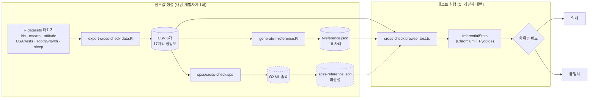
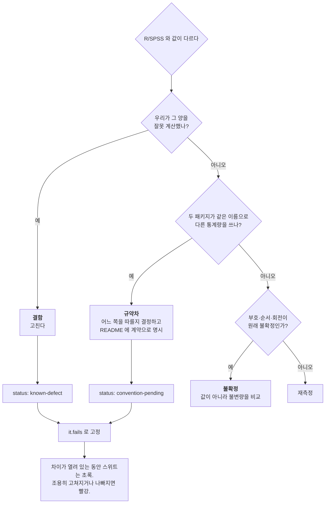
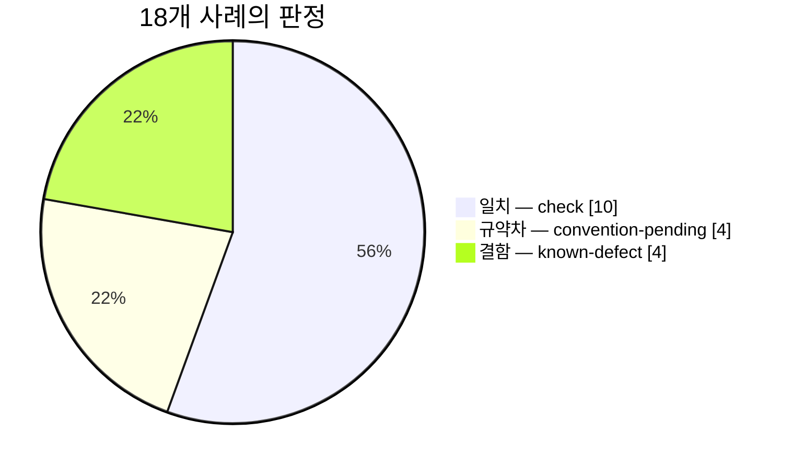
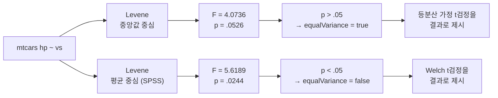

# R 교차검증 1차 실행 보고서

2026-10-06 · 대상 `@winm2m/inferential-stats-js` v1.9.0 · 참조 R 4.2.2 Patched
브랜치 `test/cross-check-r-spss`

이 문서는 **무엇을 어떻게 돌려서 무엇을 알아냈는지의 기록**이다. 설계 근거와
앞으로의 계획은 [`cross-check-r-spss.md`](./cross-check-r-spss.md), SPSS 실행 절차는
[`spss-manual-run.md`](./spss-manual-run.md) 에 있다.

---

## 1. 왜 했나

이 라이브러리는 브라우저 안에서 Pyodide 로 scipy·statsmodels·scikit-learn 을 돌린다.
기존 검증은 두 층이었다.

| 층 | 내용 | 덮는 범위 |
| :--- | :--- | :--- |
| 단위 98건 + 브라우저 e2e 2건 | 분석이 **돌아가는지**, 결과 모양이 맞는지 | 17개 공개 메서드 전부 |
| NIST StRD 인증값 4건 | 결과가 **맞는지** | `linearRegression`, `anovaOneway` 2개 |

NIST 가 인증하는 절차는 네 가족뿐이다. 그래서 **열다섯 개 메서드는 "오류 없이 숫자를
돌려준다"까지만 보증**된 상태였다. 틀린 숫자도 모양은 맞다.

연구자가 실제로 결과를 맞춰 보는 대상은 R 과 SPSS 다. 그 둘에 같은 데이터를 걸어
비교하는 것이 이 작업이다.

---

## 2. 전체 구조



**핵심은 세 소비자가 같은 CSV 바이트를 읽는다는 점이다.** R 의 메모리 안 데이터셋을
직접 쓰지 않고 일부러 CSV 로 내보낸 뒤 그것을 R 이 다시 읽는다. 그러지 않으면
"반올림이 다른 두 사본"을 비교하게 되어, 차이가 나왔을 때 입력 때문인지 계산 때문인지
가릴 수 없다.

**참조값은 커밋한다.** 테스트를 돌릴 때는 R 도 SPSS 도 필요 없다. NIST 픽스처와 같은
방식이다 — CI 에 통계 툴체인이 들어가지 않는다.

---

## 3. 데이터 — 무엇을 마련했나

R 의 `datasets` 패키지에서 여섯 개를 골랐다. 조건은 셋이었다.

1. **재배포 가능** — GPL-2 로 R 과 함께 배포되고, 누구의 표본도 아닌 공표된 표다.
2. **R·SPSS 양쪽에서 동일** — 양쪽이 같은 숫자를 본다는 것 자체가 전제다.
3. **diff 로 읽을 만큼 작다** — 변경이 일어나면 눈에 보여야 한다.

| 데이터셋 | 크기 | 성격 | 쓰인 절차 |
| :--- | :--- | :--- | :--- |
| `iris` | 150 × 5 | 3집단 연속형 | 일원 ANOVA, Tukey HSD |
| `ToothGrowth` | 60 × 3 | 2 × 3 설계 | 독립표본 t, 교차표(2×3) |
| `sleep` | 10 × 3 (wide 변환) | 대응 설계 | 대응표본 t |
| `mtcars` | 32 × 12 | 연속형 + 이분형 `am`·`vs` | 선형회귀, 이진 로지스틱, 교차표(2×2) |
| `attitude` | 30 × 7 | 리커트형 7문항 | Cronbach α |
| `USArrests` | 50 × 5 | 연속형 4변수 | 기술통계 |

`sleep` 은 원래 long 형태(관측 1건 1행)인데, `ttestPaired` 와 SPSS `T-TEST PAIRS`,
R `t.test(paired=TRUE)` 는 모두 한 쌍이 한 행에 있어야 한다. 그래서 export 단계에서
wide 로 돌려 한 곳에서만 처리한다.

SPSS 자체 샘플 파일(`Employee data.sav` 등)은 **쓰지 않았다.** SPSS 설치본에
라이선스된 파일이라 이 저장소에 커밋할 수 없다.

---

## 4. 판정 체계 — 차이를 세 갈래로 가른다

이것이 설계의 핵이다. "SPSS 와 숫자가 다르다"는 사실만으로는 아무것도 고칠 수 없다.



`it.fails` 는 NIST 테스트가 Longley 에 쓰는 장치를 그대로 가져온 것이다. 톨러런스를
풀어 차이를 흡수하지 않는다 — **차이를 실행 가능한 증거로 남긴다.** 결함이 고쳐지면
그 테스트가 빨개지고, 그때 status 를 바꾸는 것이 수정의 일부가 된다.

### 주장 하나당 사례 하나

`crosstabs` 는 카이제곱은 맞게 계산하면서 범주 이름을 틀리게 붙인다. 둘을 한 사례에
묶으면 `it.fails` 하나가 양쪽을 덮어, 나중에 카이제곱이 틀어져도 "여전히 실패 중"으로
보고된다. 그래서 통계량 사례와 라벨 사례를 따로 두었다.

---

## 5. 무엇을 어디에 돌렸나

**18개 사례**(픽스처 자체 점검 1건을 더해 테스트 19건). `check` 는 일치해야 하는 것,
나머지는 차이가 선언된 것이다.

| # | 사례 | 데이터 | SDK 메서드 | R 참조 | 비교 항목 | status |
| :-- | :--- | :--- | :--- | :--- | --: | :--- |
| 1 | 기술통계 (g1/g2) | USArrests | `descriptives` | `e1071::skewness(type=1)`, `quantile(type=7)`, `sd` | 40 | check |
| 2 | 기술통계 (G1/G2) | USArrests | `descriptives` | `e1071::skewness(type=2)` | 40 | **convention** |
| 3 | 교차표 2×3 | ToothGrowth | `crosstabs` | `chisq.test(correct=FALSE)` | 4 | check |
| 4 | 교차표 2×2 Pearson | mtcars | `crosstabs` | `chisq.test(correct=FALSE)` | 4 | **convention** |
| 5 | 교차표 2×2 Yates | mtcars | `crosstabs` | `chisq.test(correct=TRUE)` | 4 | check |
| 6 | 교차표 범주 라벨 | ToothGrowth | `crosstabs` | `rownames/colnames(table(...))` | 라벨 5 | **defect** |
| 7 | 교차표 범주 라벨 | mtcars | `crosstabs` | `rownames/colnames` | 라벨 4 | **defect** |
| 8 | 독립 t + Levene(중앙값) | ToothGrowth | `ttestIndependent` | `t.test`, `car::leveneTest(center=median)` | 26 | check |
| 9 | Levene(평균) | ToothGrowth | `ttestIndependent` | `car::leveneTest(center=mean)` | 2 | **convention** |
| 10 | 독립 t + Levene(중앙값) | mtcars | `ttestIndependent` | 같음 | 26 | check |
| 11 | Levene(평균) — 판정 역전 | mtcars | `ttestIndependent` | 같음 | 2 + 판정 1 | **convention** |
| 12 | 대응 t | sleep | `ttestPaired` | `t.test(paired=TRUE)` | 10 | check |
| 13 | 일원 ANOVA | iris | `anovaOneway` | `aov` + `summary` | 18 | check |
| 14 | Tukey HSD | iris | `posthocTukey` | `TukeyHSD` | 12 | **defect** |
| 15 | 선형회귀 (`method:'enter'`) | mtcars | `linearRegression` | `lm`, `confint`, `car::durbinWatsonTest` | 32 | check |
| 16 | 선형회귀 (method 미지정) | mtcars | `linearRegression` | 같음 | 6 + 결측 3 | **defect #13** |
| 17 | 이진 로지스틱 | mtcars | `logisticBinary` | `glm(binomial)`, `confint.default` | 27 | check |
| 18 | Cronbach α | attitude | `cronbachAlpha` | 공식 직접 구현 + `cor` | 52 | check |

비교 항목은 **잎 단위로 센 것**이다. 예컨대 15번은 계수 4개 × (계수·표준오차·t·p·CI
하한·CI 상한) + 모형요약 8개 = 32개 숫자를 각각 대조한다. 합계 **수치 305개 + 문자열
라벨 10개**를 항목별로 맞춰 봤다. 6·7번은 라벨만 보므로 수치 비교가 0이다.

### 비교 방식 — 위치가 아니라 신원으로 맞춘다

R 은 Tukey 대비를 `"virginica-setosa"` 로 적고 statsmodels 는 쌍의 순서를 다르게
잡는다. 둘 다 맞다. 그래서 배열을 인덱스로 비교하지 않고 식별 키(`group1`+`group2`,
`variable`, `item`, `group`)로 짝지은 뒤 비교한다. 신뢰구간처럼 순서가 의미인 것은
위치로 비교한다.

### 톨러런스 — 한 값으로 안 된다

| 대상 | 톨러런스 | 왜 |
| :--- | :--- | :--- |
| 닫힌 형태 (t·ANOVA·OLS·χ²·α) | **1e-9** 상대 | R 과 같은 추정식을 같은 바이트에 적용하므로, 벌어질 여지는 부동소수점 결합 순서뿐이다. NIST 작업에서 이 코드베이스가 9자리를 유지함을 확인했다 |
| 반복추정 (로지스틱) | **1e-5** 상대 | R 은 IRLS(`epsilon=1e-8`), statsmodels 는 Newton-Raphson. 둘 다 정확한 최대점에서 멈추지 않으므로 벌어지는 거리는 수렴 기준이 정하고, 부동소수점 오차가 아니다 |
| SPSS | 미정 | OXML 이 원값을 들고 있으면 조일 수 있다. 형식 문자열만 얻는다면 피벗표 소수 3자리에서 오는 양자화 때문에 5e-4 절대 / 1e-3 상대가 상한이다 |

---

## 6. 결과



결함 4사례는 **서로 다른 결함 3개**다. `crosstabs` 라벨 문제가 두 데이터셋에 걸쳐
두 사례로 들어가 있다.

### 6.1 일치한 것 — check 10사례, 수치 239개

| 사례 | 비교 수 | 최대 상대오차 | 가장 큰 오차가 난 항목 |
| :--- | --: | --: | :--- |
| 기술통계 (g1/g2) | 40 | `1.06e-14` | `Rape.kurtosis` |
| 교차표 2×3 | 4 | `0` | — (완전일치) |
| 교차표 2×2 Yates | 4 | `7.99e-16` | `pValue` |
| 독립 t — ToothGrowth | 26 | `2.50e-14` | `unequalVariance.confidenceInterval[0]` |
| 독립 t — mtcars | 26 | `2.83e-15` | `unequalVariance.confidenceInterval[1]` |
| 대응 t | 10 | `3.11e-11` | `confidenceInterval[1]` |
| 일원 ANOVA | 18 | `1.05e-14` | `pValue` |
| 선형회귀 (`enter`) | 32 | `2.73e-11` | `coefficients[disp].coefficient` |
| 이진 로지스틱 | 27 | `8.92e-07` | `coefficients[hp].confidenceInterval[0]` |
| Cronbach α | 52 | `4.49e-15` | `itemAnalysis[advance].itemStd` |

239개 중 **224개가 1e-9 이내**이고, 1e-9 을 넘는 15개는 **전부 로지스틱 사례**에 있다.
즉 닫힌 형태 절차 9사례(212개 수치)는 한 항목도 1e-9 를 넘지 않았다. 대응 t 의
`3.11e-11` 과 회귀계수의 `2.73e-11` 은 뺄셈에서 유효자리를 쓰는 양이라 예상 범위다.

로지스틱만 자리수가 다르다. 27개 항목 중 15개가 1e-9 를 넘고, 그 분포가 원인을 그대로
보여 준다.

| 양 | 상대오차 |
| :--- | --: |
| 표준오차, z | `3.8e-08` ~ `5.3e-08` |
| p값 | `1.9e-07` ~ `4.1e-07` |
| 신뢰구간 경계 | `2.3e-08` ~ `8.9e-07` |

신뢰구간이 가장 나쁜 것은 당연하다 — `계수 ± 1.96 × 표준오차` 이므로 두 오차를 함께
짊어진다. 이것은 결함이 아니라 **두 솔버의 정지 규칙이 다르다는 사실**이고, 그래서
이 사례만 톨러런스를 1e-5 로 두고 측정값을 생성기에 기록했다.

### 6.2 새로 찾은 결함 2건

#### (가) `posthocTukey` — 모든 값이 소수 4자리로 절단된다

`compare-means.ts:199-206` 이 `pairwise_tukeyhsd(...).summary().data` 를 읽는다.
그것은 statsmodels 의 **출력용 표**이고 표시를 위해 4자리로 포맷된다.

| 대비 | 항목 | 우리 | R | 상대오차 |
| :--- | :--- | --: | --: | --: |
| setosa–versicolor | `pValue` | **`0`** | `3.386e-14` | `1.00` |
| setosa–virginica | `pValue` | **`0`** | `2.998e-15` | `1.00` |
| versicolor–virginica | `pValue` | **`0`** | `8.288e-09` | `1.00` |
| versicolor–virginica | `lowerCI` | `0.4082` | `0.408227294142112` | `6.69e-05` |
| setosa–versicolor | `lowerCI` | `0.6862` | `0.686227294142111` | `3.98e-05` |
| versicolor–virginica | `upperCI` | `0.8958` | `0.895772705857888` | `3.05e-05` |
| setosa–virginica | `lowerCI` | `1.3382` | `1.33822729414211` | `2.04e-05` |

**p값이 정확히 `0` 으로 나온다.** `8.3e-09` 이 `0.0000` 으로 포맷된 뒤 그것을
`float()` 로 읽기 때문이다. 이것은 **#12 와 같은 고장 양상** — 작은 값이 조용히 0이
되는 것 — 이고, 연구자가 논문에 "p = 0" 을 적게 된다.

#12 수정(PR #17)이 여기 닿지 않은 이유가 중요하다. 그 PR 은 우리 코드의 `round(x, 6)`
133곳을 지웠다. 여기서는 **반올림이 우리 코드가 아니라 우리가 읽고 있는 객체에 있다.**
원값은 결과 객체에 그대로 있다 — `meandiffs`, `pvalues`, `confint`, `reject`.

NIST 검증 스위트가 이것을 못 잡은 것도 설명된다. NIST 는 Tukey 를 인증하지 않는다.

#### (나) `crosstabs` — 수치형 범주 이름

`descriptive.ts:98-99` 의 `str(x)` 가 float 범주에 적용된다.

| 데이터 | 항목 | 우리 | R·SPSS |
| :--- | :--- | :--- | :--- |
| ToothGrowth | `colLabels` (dose) | `['0.5', '1.0', '2.0']` | `['0.5', '1', '2']` |
| mtcars | `rowLabels` (am) | `['0.0', '1.0']` | `['0', '1']` |
| mtcars | `colLabels` (vs) | `['0.0', '1.0']` | `['0', '1']` |

숫자는 맞다. 다만 이 라벨이 **표의 행·열 머리글**이라 읽는 사람에게 그대로 보인다.

### 6.3 이미 등록된 결함 — #13 재현, 범위 축소

`method` 를 비우면 `linearRegression` 이 stepwise 로 빠져 요청하지 않은 모형을 적합한다.

`mpg ~ wt + hp + disp` 를 요청했을 때:

| 항목 | 우리 (기본값) | R `lm` | 결과 |
| :--- | --: | --: | :--- |
| `disp` 계수 | **없음** | `-0.000937009` | 예측변수가 조용히 사라짐 |
| `wt` 표준오차 | `0.6327` | `1.0662` | `-41%` |
| `const` 표준오차 | `1.5988` | `2.1108` | `-24%` |
| `hp` 표준오차 | `0.009030` | `0.011436` | `-21%` |
| `wt` 계수 | `-3.8778` | `-3.8009` | `+2.0%` |
| `hp` 계수 | `-0.031773` | `-0.031157` | `+2.0%` |

표준오차가 20~40% 작게 나오는 것은 모형이 다르기 때문이다 — 변수를 뺀 2예측변수
모형에서는 잔차자유도와 다중공선성이 모두 달라진다. **p값과 신뢰구간이 전부 좁아지므로
유의성 판정이 낙관적으로 기울어진다.**

같은 호출에 `method: 'enter'` 를 주면 **32개 항목 전부 1e-11 이내로 `lm` 과 일치한다**
(계수·표준오차·t·p·신뢰구간·ANOVA 표·Durbin-Watson 포함). 즉 **결함은 추정량이 아니라
기본값이다.** NIST Longley 가 `it.fails` 인 이유도 같다.

### 6.4 결정이 필요한 규약차 4건

코드를 읽고 예측한 3건이 전부 확인되고, 하나가 더 나왔다.

#### ① skewness · kurtosis 의 형태

`descriptive.ts:71` 의 `scipy.stats.skew(col)` 은 `bias=True` 가 기본이라 모적률
g1·g2 를 낸다. SPSS 는 표본보정형 G1·G2 를 찍는다.

| 변수 | 항목 | 우리 (g) | SPSS (G) | 상대오차 |
| :--- | :--- | --: | --: | --: |
| Rape | kurtosis | `0.20190` | `0.35396` | **`43.0%`** |
| UrbanPop | kurtosis | `-0.78421` | `-0.73836` | `6.2%` |
| Murder | kurtosis | `-0.86467` | `-0.82749` | `4.5%` |
| Assault | kurtosis | `-1.06902` | `-1.05385` | `1.4%` |
| 네 변수 전부 | skewness | — | — | `3.025%` (일정) |

왜도의 오차가 네 변수에서 **정확히 같은 3.025%** 인 것이 진단이다. G1/g1 =
√(n(n−1))/(n−2) 이고 n=50 에서 1.03025 다. 즉 산술이 아니라 보정계수 하나의 문제다.

첨도 쪽은 변수마다 다르고 Rape 에서 43%까지 벌어진다. 초과첨도가 0 근처일 때 보정항이
상대적으로 커지기 때문이다. **0 근처 값이라 실무 해석은 잘 안 바뀌지만, 숫자를 SPSS
출력과 나란히 놓으면 틀린 것처럼 보인다.** SPSS 가 함께 찍는 왜도·첨도의 표준오차도
우리는 내지 않는다.

#### ② Levene 검정의 중심 — 이것은 결과를 바꾼다

`compare-means.ts:32` 의 `scipy.stats.levene` 은 `center='median'`(Brown-Forsythe)이
기본이다. SPSS `T-TEST` 는 평균을 중심으로 한다.



`compare-means.ts:33` 이 `equal_var = levene_p > 0.05` 로 분기한다. 그래서 중심 선택이
**어느 t검정이 "결과"로 제시되는지를 바꾼다** — 부수적인 숫자 하나가 아니다.

| 데이터 | 우리 F / p | SPSS F / p | `equalVariance` |
| :--- | --: | --: | :--- |
| mtcars `hp ~ vs` | `4.0736` / `.05258` | `5.6189` / `.02439` | **`true` vs `false`** |
| ToothGrowth `len ~ supp` | `1.2136` / `.27518` | `1.0973` / `.29920` | `true` (양쪽 동일) |

ToothGrowth 처럼 p 가 .05 에서 멀면 아무 일도 안 일어난다. **.05 를 사이에 두고
갈리는 사례를 일부러 찾아 스위트에 고정했다** — 그러지 않으면 이 규약차가 무해해
보인다.

#### ③ 2×2 카이제곱의 연속성 보정

`descriptive.ts:88` 의 `chi2_contingency(ct)` 는 `correction=True` 가 기본이라 2×2 에
Yates 보정을 적용한다. SPSS 는 주행(primary row)에 무보정 Pearson 을 놓고 연속성 보정은
별행에 둔다.

| mtcars `am × vs` | 우리 (Yates) | SPSS 주행 (Pearson) | 상대오차 |
| :--- | --: | --: | --: |
| `chiSquare` | `0.34754` | `0.90688` | **`61.7%`** |
| `pValue` | `0.55551` | `0.34094` | `62.9%` |
| `cramersV` | `0.10421` | `0.16835` | `38.1%` |

이 표는 양쪽 다 비유의라 결론이 같지만, **표본이 작고 χ² 가 임계값 근처면 보정 유무가
유의성을 뒤집는다.** 2×3 표(ToothGrowth)에서는 어느 패키지도 보정을 안 하므로 완전
일치했다 — 그래서 3번 사례를 따로 둬서 산술과 보정 문제를 분리했다.

#### ④ `pseudoRSquared` 의 종류

`logisticBinary` 가 돌려주는 값은 statsmodels `prsquared`, 즉 McFadden 이다.
SPSS `LOGISTIC REGRESSION` 은 **Cox & Snell 과 Nagelkerke 를 찍고 McFadden 칼럼은
아예 없다.** 비교할 대상이 없는 것이라 숫자 차이로 다룰 수 없다. 참조값 생성기가
SPSS 두 값을 `note` 에 같이 담아 두었으니, **README 에 어느 것인지 명시**하면 끝난다.

---

## 7. 아직 안 덮은 것

| 절차 | 왜 아직 아닌가 |
| :--- | :--- |
| `efa`, `pca`, `mds`, `kmeans`, `hierarchicalCluster` | 출력이 부호·회전·군집 레이블에 대해 **불확정**이다. 값을 직접 비교하면 의미 없는 실패가 난다. 로딩은 부호 정렬 후 절대값, MDS 는 좌표 대신 거리행렬, 군집은 조정 랜드지수로 비교해야 한다 |
| `logisticMultinomial` | #14 로 `stdError`·`z`·`p`·신뢰구간이 `0.0` 으로 하드코딩돼 비교할 것이 없다. 게다가 밑의 추정량이 `sklearn.linear_model.LogisticRegression` 이라 기본적으로 L2 벌점을 걸고 **벌점 우도**를 최대화한다 — `nnet::multinom`·SPSS `NOMREG` 와 다른 함수다 |
| `frequencies` | 낮은 위험이라 2차로 미뤘다 |
| SPSS 전 계층 | 상용 라이선스. `.sps` 와 절차는 준비됐고 1회 실행 대기 |

---

## 8. 재현 방법

```bash
cd /contents/workspace/inferential-stats-js
git checkout test/cross-check-r-spss

# R 과 참조 패키지 (Debian/Ubuntu)
apt-get install -y --no-install-recommends \
  r-base-core r-cran-jsonlite r-cran-psych r-cran-e1071 r-cran-car \
  r-cran-nnet r-cran-mass r-cran-cluster

npm run export-cross-check-data   # CSV 재생성 — 재실행은 no-op 이어야 한다
npm run generate-r-reference      # r-reference.json 재생성

npx playwright install chromium
npm test                          # NIST + 교차검증 + 기존 e2e
```

참조값 픽스처는 커밋돼 있으므로, **테스트만 돌릴 때는 R 이 필요 없다.**

실행 환경: Chromium(Playwright), Pyodide 안의 scipy·statsmodels·scikit-learn·
factor_analyzer. 교차검증 테스트 19건 소요 29.5초 — Pyodide 와 패키지 로드가 그중
8.6초다(첫 사례에 포함된다).

---

## 9. 요약

| | |
| :--- | :--- |
| 마련한 데이터 | R `datasets` 6개 → 17자리 CSV, 세 패키지가 같은 바이트를 읽음 |
| 돌린 사례 | 18건 / 10개 메서드 / 수치 305개 + 라벨 10개 (테스트 19건) |
| 일치 | check 10사례 239개 중 224개가 1e-9 이내. 닫힌 형태 9사례는 전원 1e-9 이내 — 최악 `3.1e-11`, 대부분 `1e-14` 대 |
| 반복추정 | 로지스틱 27항목 최악 `8.9e-07` — 솔버 수렴 기준 차이, 결함 아님 |
| 새 결함 | `posthocTukey` 4자리 절단(p값이 `0` 으로 나옴), `crosstabs` 범주 라벨 |
| 재현된 결함 | #13 — 기본값이 stepwise. `method:'enter'` 는 1e-11 로 정확 |
| 결정 필요 | 규약 4건 (왜도·첨도 형태 / Levene 중심 / 2×2 보정 / pseudo R² 종류) |
| 미착수 | 불확정 출력 5개 메서드, `logisticMultinomial`(#14 선행), SPSS 전 계층 |

**이 작업이 산출한 것은 "맞다"는 보증이 아니라 경계선이다.** 어디까지 외부 참조값과
일치하는지, 어디가 결함인지, 어디가 규약 선택이고 그 선택이 무엇을 바꾸는지 —
그 세 가지가 이제 실행 가능한 테스트로 고정돼 있다.
